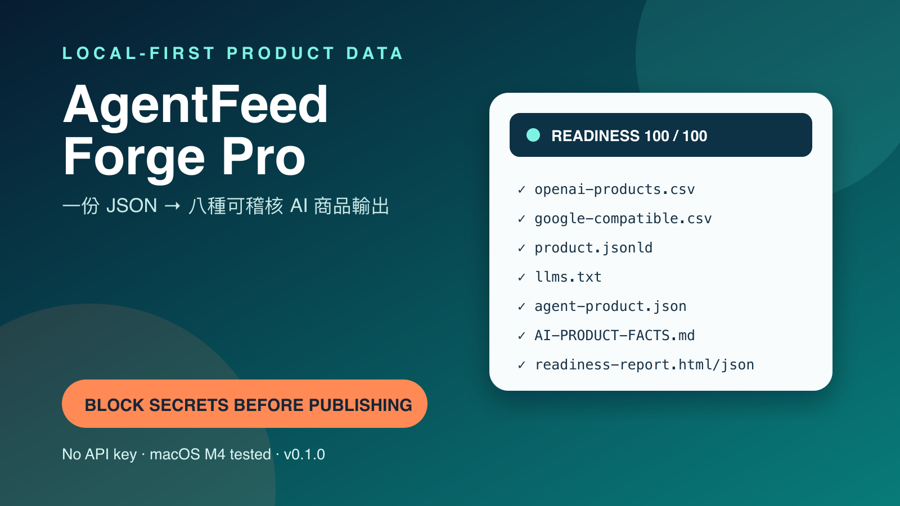
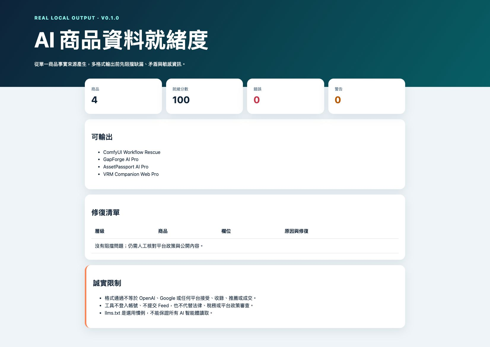
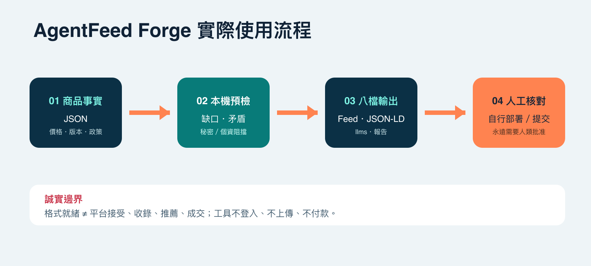

# AgentFeed Forge

> 免費在本機驗證 1 個數位商品 JSON；Pro 在 10 分鐘內把最多 50 個商品轉成八種可稽核、AI 可讀的資料輸出。

**Pro — US$19｜目前為已驗收草稿，Gumroad 買家檔案上傳完成前不接受購買。** · [觀看真實 Demo](#真實-demo) · [比較 Free／Pro](#freepro-比較) · [買家會拿到什麼](#買家會拿到什麼)

本機離線 · 不需 API Key · macOS M4 實測 · v0.1.0



## 30 秒開始

```bash
python3 agentfeed_validator.py examples/product-complete.json
```

Free 只輸出一個驗證摘要，不生成完整 Feed。把 `examples/product-complete.json` 複製成自己的檔案，修改商品事實後再執行。

## 真實 Demo



這張圖由 Pro v0.1.0 實際讀取 ComfyUI Workflow Rescue、GapForge AI Pro、AssetPassport AI Pro 與 VRM Companion Web Pro 後生成；不是概念圖。實際流程如下：



## Free／Pro 比較

| 能力 | Free（本 Repo） | Pro（買家 ZIP） |
|---|---|---|
| 商品數量 | 1 | 最多 50／批次 |
| 第一次結果 | JSON 缺口摘要 | 完整八檔商品資料包 |
| OpenAI／Google CSV | 不產生 | 產生 |
| JSON-LD／llms.txt | 不產生 | 產生 |
| 跨商品重複與版本檢查 | 不含 | 包含 |
| 敏感資料阻擋 | 秘密／私人路徑 | 再加電話／地址與公開輸出 gate |
| 商業交付與繁中指南 | 不含 | 包含 |

## 買家會拿到什麼

`AgentFeed-Forge-Pro-v0.1.0.zip`：零依賴 Pro CLI、macOS／Windows 啟動器、繁中 README／快速開始／完整指南／故障排除、中文範例、真實四商品 Demo、英文快速文件、測試報告、授權與版本紀錄。

永久使用 v0.1.0，包含 v0.1.x 修正；不承諾所有未來重大版本或無期限人工支援。Windows／Linux 為設計支援但未實機驗證。

## 誠實限制

格式通過不等於 OpenAI、Google 或任何平台接受、收錄、推薦或成交。本工具不登入、不提交 Feed、不付款，也不是 MCP Server 或 A2A Agent。所有購買、上傳與發布動作都需要人類明確批准。

## 授權

Free 驗證器為 MIT License；Pro 買家 ZIP 使用個人／單一工作室商業授權，不可轉售或公開散布。
